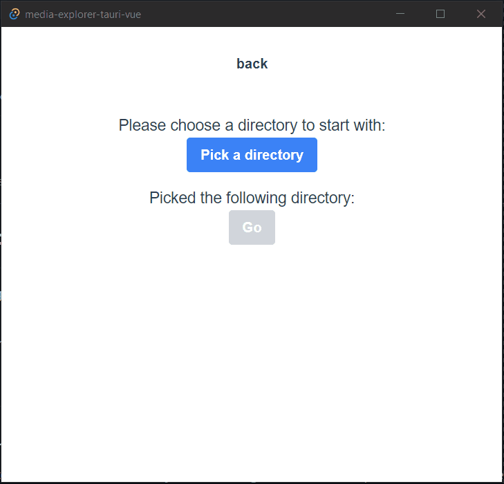

# Tauri Vue Video Explorer - proof of concept

This repository contains the source for a very simple proof-of-concept playground project for a web-based video explorer desktop app using Tauri with Vue3 as frontend framework.

It currently supports displaying the following media types:

- **video:** `.mp4, .wmv, .mkv, .webm, .ts`
- **audio:** `.mp3`
- **image:** `.png, .jpg, .jpeg`
- **text:** `.txt` (default representation for all other files)

### Goals and Outcome

The main goal of this project was verifying that a Tauri desktop app is able to display high quality media files in a way that is comparable to true local playback.

| Goal                                               | Result | Comment                                                                                                                 |
| -------------------------------------------------- | :----: | ----------------------------------------------------------------------------------------------------------------------- |
| View basic media files (audio, images)             |   ✔️   | However larger image files don't load instantly, causing pop-up behavior (ex. 10MB image takes ~90ms)                   |
| View basic video files up to 720p                  |   ✔️   | It's important to use convertLocalSrc instead of loading the file directly. Scrubbing seems to work without problems    |
| View high quality video files up to 4k             |   🟡   | Scrubbing is not as smooth as on real local playback, very high quality videos seem to stutter/buffer sometimes.        |
| View multiple video files on a single page at once |   🟡   | Causes noticeable stutters, a real "gallery" view would require smart un-loading of media.                              |
| View HEVC or NVENC files                           |   ❌   | HTML5 video player doesn't seem to load the files (at least on a Windows system), may be possible with additional work. |

## Demo



## Development

### Running locally

```
npm run tauri:serve
```

### Building the app

```
npm run tauri:serve
```
